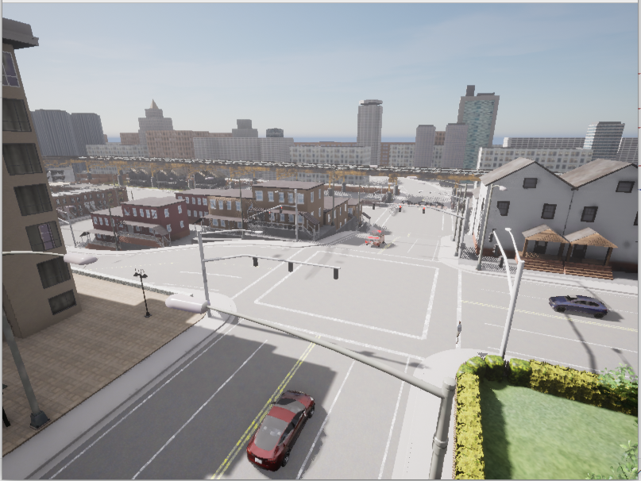
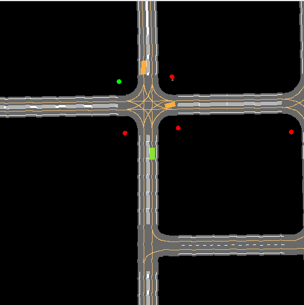
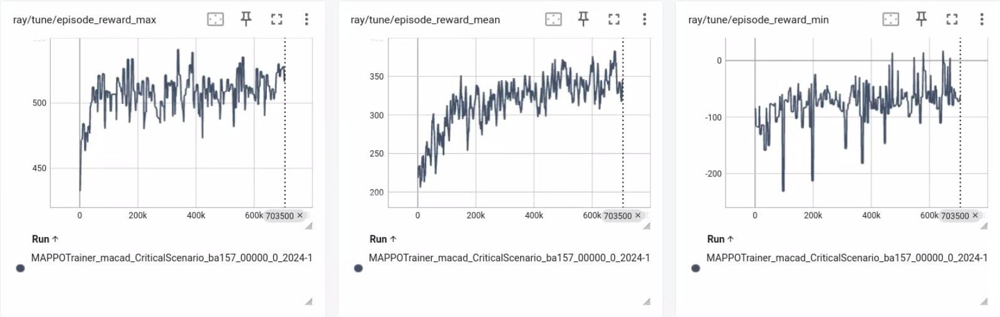
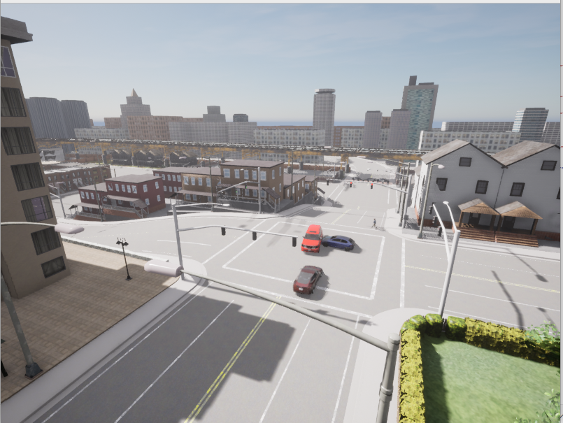
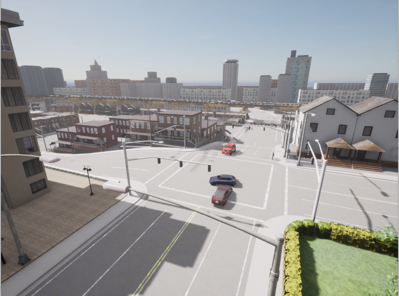
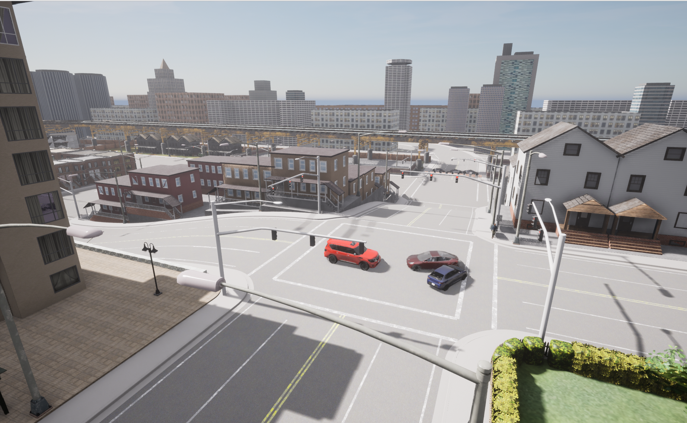

# MARL-adv-npc

This repository contains adversarial NPCs (Non-Player Characters) model trained with MARL algorithm to generate critical driving scenarios. By employing multi-agent reinforcement learning, we train NPC vehicles and pedestrians to create challenging traffic situations, helping evaluate and improve autonomous driving systems' safety in complex scenarios.

# Environment Setup

1. Carla 0.9.12+
2. Python 3.8+

```bash
conda create -n marllib python=3.8 -y
conda activate marllib
python -m pip install -r requirements.txt

git clone https://github.com/TrustAISys/MARLlib.git
cd MARLlib
pip insatll -e .
python marllib/patch/add_patch.py -y
```

# Scenarios

The testing scenario takes place at a four-way intersection in CARLA Town03 map, featuring heterogeneous actors: one ego vehicle, two NPC vehicles, and one pedestrian. Each actor type has distinct action spaces and movement constraints - vehicles follow road networks while pedestrians can move more freely. This heterogeneity creates rich interaction possibilities at the crossroad, where the ego vehicle must navigate through potential conflicts with other road users coming from different directions.

<p float="left">
    
    
</p>

# Training Setup

We use Carla's [BasicAgent](https://github.com/carla-simulator/carla/blob/0.9.15/PythonAPI/carla/agents/navigation/basic_agent.py) as the ego vehicle policy. Then train the NPCs using Multi-Agent PPO (MAPPO) algorithm with [MARLlib](https://github.com/TrustAISys/MARLlib). 

The NPCs learn collaboratively to create challenging situations. Action padding is used to handle the heterogeneous action spaces of different NPC types.



# Inference Result

The trained adversarial NPC could generate multiple types of critical-scenarios, some typical scenario are shown below.

1. NPC vehicles block the road



2. NPC vehicle quickly make a turn in front of Ego



3. NPC vehicles "counter" Ego between them


